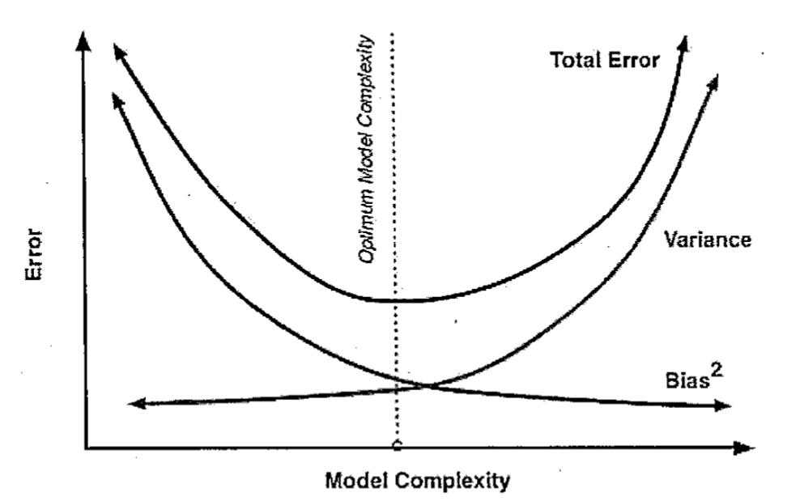
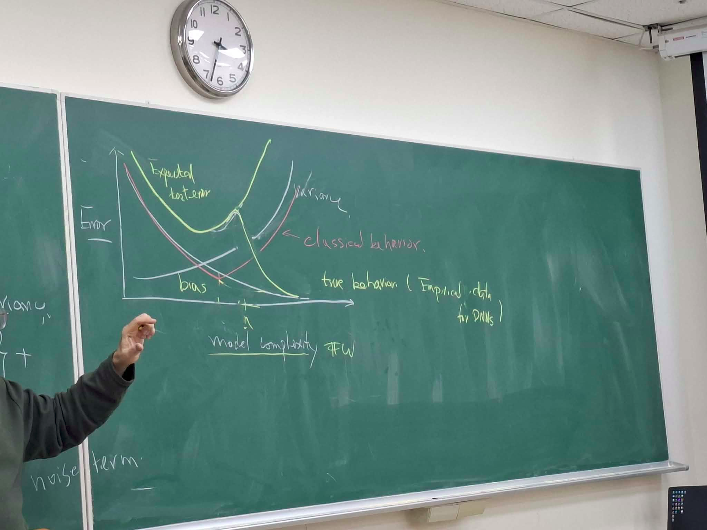

# Course Focus
1. Generalization error without density functions

2. Kernel method
- relate each prediction to train data without obtain explanation

3. Generator

# Bias-Variance trade-off

#### variables define
Given $D=\{(x_i, y_i)\}_{i=1}^n$ is a collection of i.i.d. random variables, (in practical, supervised data), $(x_i, y_i)\sim P$, $P$ is a P.D.F
$\bar y(x) = \mathbb E_{y|x}[y]=\int y \mathbb P(y|x)dy$

$H$ is a hypothesis set
$h_D\in H$ is a model obtained based on $D$ (e.g. by training, optimizing)

#### Experced test error
- expected test error w.r.t. D:
$\mathbb E_{(x,y)\sim P}[(h_D(x)-y)^2] = \iint (h_D(x)-y)^2P(x,y)dydx$, 
which is a $D$-dependent random variable.(because $h_D$ is picked w.r.t. $D$)

Let $\bar h(x)=\mathbb E_{D\sim P^n} [h_D(x)]$

- the Expected test error
$\mathbb E_{D\sim  P^n} \mathbb E_{(x,y)\sim P} [(h_D(x)-y)^2] = E_{(x,y), D} \{ (h_D(x) - \bar h(x) + \bar h(x) - y)^2\}$
$=\mathbb E_{(x,y), D}\{(h_D(x)- \bar h(x))^2\} +$
$\mathbb E_{(x,y)} \{(\bar h(x)-y)^2\} +$
$2 \mathbb E_{(x,y), D} \{\underbrace{(h_D(x) - \bar h_D(x)}_{=0})(\bar h(x)-y)\}$

at here,
$\mathbb E_{(x,y)} \{(\bar h(x)-y)^2\} = \mathbb E_{x,y} \{(\bar h(x) - \bar y(x))^2\} + \mathbb E_{x,y}\{(\bar y(x) - y)^2\} + 2 \mathbb E_{x,y}\{(\bar h(x) - \bar y(x))\underbrace{(\bar y(x) - y)}_{=0}\}$

Therefore, we have the following form of Expected Test Error:
$\mathbb E_D \mathbb E_{(x,y)\sim P} [(h_D(x) - y)^2] = 
\underbrace{\mathbb E_{x,D}\{ (h_D(x) - \bar h(x))^2\}}_{variance\ from\ hypothesis\ space} + 
\underbrace{\mathbb E_{(x,y)}\{(\bar h(x) - \bar y(x))^2\}}_{bias\ from\ hypothesis\ space} + 
\underbrace{\mathbb E_{x,y} \{(\bar y(x) - y)^2\}}_{noise}$

Expected Test Error is a constant, and noise is constant too
therefore, we need to trade-off between variance and bias, one is smaller then another will be larger.

trade-off curve

however, in practical the model encounter double descent:

Expected test error $\le$ Train error + Regulization term

generalization error $=$ |Expected test error - train error|

What is the parameters induced by $H$ that are relevant to generalization error.

#### PAC framework
original designed for binary classification problem
1. a set of hypothesis
$H = \{h| h: X \to Y\}$
2. a true classification function $c\in H$ (let's assume the target function exist at $H$ for convinience)
3. Data are i.i.d. $\sim D$ ($(x,c(x))$), this case have no noise
4. loss function, e.g. $\ell(h(x), y) = \begin{cases}
1 & {\rm if}\ h(x)\neq y\\
0 & {\rm otherwise}
\end{cases}$
5. an algorithm $A:D^n\to h\in H$

$R_S(h)=\frac 1m \sum_{i=1}^m \ell (c(x_i), h(x_i))$, $h\in H$ is obtaubed by applying $A$ to $g=\{(x_i, y_i)\}_{i=1}^m$

$R(h)= \mathbb E_{(x, c(x))\sim D} \{\ell(c(x), h(x))\}$ the expected test error of $h$

$|R(h)- R_S(h)|$ is the generalization error.
A target function $c$ is PAC learnable w.r.t. $H$ if there is algorithm $A$ and a number $m_0^A(\epsilon, \delta)$, the sample complexity, such that for any $m\ge m_0^A(\epsilon, \delta)$, algorithm can find $h\in H$ to satisfy $\mathbb P[R(h) < \epsilon] \ge 1-\delta$. (iff $\mathbb P[R(h) \ge \epsilon] < \delta$)

##### an example of PAC
- $|H|$ is finite
- Algorithm:
    for any data, $A$ arbitrary pick a $h$ which make $R_S(h)=0$

For any $\epsilon,\delta\in (0,1)$, with $|H|(1-\epsilon)^m \le 1$, the inequality $\mathbb P[R(h) < \epsilon>]\ge 1-\delta$ hold if
$m\ge \frac 1\epsilon [\log |H| + \log \frac 1\delta]$
so, $c\in H$ is PAC learnable.
besides, we can conclude the bound of $R(h)$:
- $R(h) < \frac 1m (\log |H| + \log \frac 1\delta)$

the phenomonon of double-descend does not appear in the graph of $\frac 1m (\log |H| + \log \frac 1\delta)$, so the hypothesis $|H|<\infty$ may not correct for modern Neural Network (or the upper bound is not tight enough).
