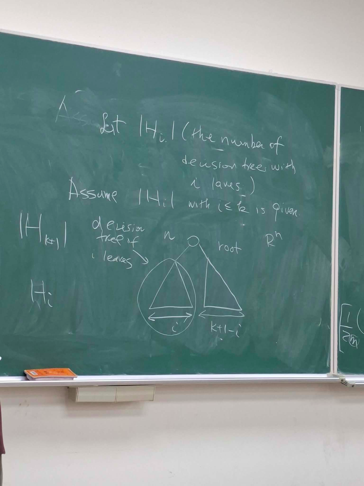
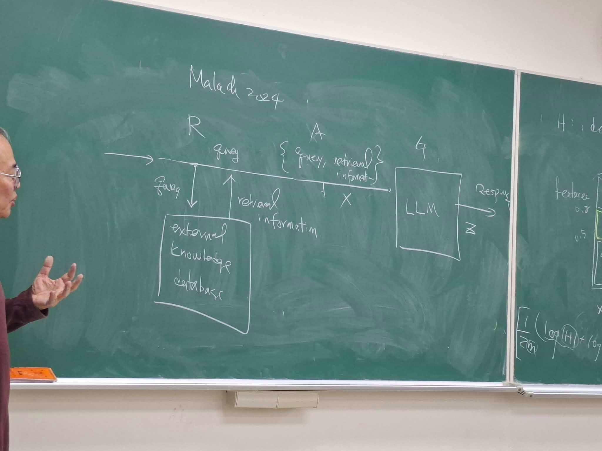

# 0312
## PAC
<!-- $|H|<\infty$, $h(x)\neq \underbrace{c(x)}_{target}$ --- empirical error -->

$P$: distribution of data

given $S = \{(\ x_i, c(x_i)\ )\}_{i=1}^m\sim P^n$
- $R_S(h) = \frac 1m \sum_{i=1}^m 1_{h(x_i)\neq c(x_i)}$ (the experiment error)

- $R(h) = \mathbb E_{(x, c(x))\sim P}[1_{h(x)\neq c(x)}] = \mathbb P\{h(x)\neq c(x)\}$
(for the binary classification)

if $S$ are i.i.d. samples, $\mathbb E_S \{R_S(h)\} = R(h)$ (from the law of large number theorem)

## Hoeffding's inequality - sum of independent bounded random variables

$S_m = z_1+...+z_m, a_i \le z_i \le b_i$

$\mathbb P(|S_m - \mathbb E[S_m]| \ge t) \le 2e^{ - \frac{2t^2}{\sum (b_i - a_i)^2}}$

#### Lemma 1.
$\mathbb P[|R_S(h) - \mathbb E[R_S(h)]|\ge \epsilon] \le 2e^{-2m\epsilon^2}$

proof.
- $R_S(h) = \frac 1m \sum_{i=1}^m 1_{h(x_i) \neq c(x_i)}$
$ = z_1+...+z_m$, where $z_i = \frac 1m 1_{h(x_i)\neq c(x_i)} \in [0,\frac 1m]$
$\le 2e^{-\frac{2\epsilon^2}{m\times (\frac 1m)^2}}$

Let $h_1,...,h_{\|H\|}$ be members in $H$
- $\mathbb P[|R_S(h) - R(h)|\le \epsilon] \ge 1-\delta$ is learned with $m\ge m(\epsilon,\delta)$

$\mathbb P[\exists h\in H: \underbrace{|R_S(h) - \mathbb E[R_S(h)]|}_{\rm generalization\ error} \ge \epsilon] = \mathbb P\cup_{i=1}^{|H|}\{|R_S(h_i) - \mathbb E[R_S(h_i)]| \ge \epsilon\}$
$\le \sum_{i=1}^{|H|} \mathbb P\{|R_S(h_i) - \mathbb E[R_S(h_i)]| \ge \epsilon\} \le 2|H| e^{-2m\epsilon^2}$

Let $2|H| e^{-2m\epsilon^2}\le \delta$, we need
$-2m\epsilon^2 \le \log \frac \delta{2|H|} \implies m \ge \frac{1}{2\epsilon^2}(\log \frac 1\delta  \log (2|H|))$

Therefore, error is bounded if $m\ge m_0(\epsilon, \delta)=\frac{1}{2\epsilon^2}(\log \frac 1\delta + \log (2|H|))$

for the consistent case, $h(x) = c(x)$, $m_0(\epsilon, \delta)=\frac{1}{2\epsilon}(\log \frac 1\delta + \log (2|H|))$, the required number of data is only $\epsilon$

$|R_S(h) - R(h)|\le \sqrt{ \frac{\log |H| + \log \frac 2\delta}{2m} }$

$\implies R(h) \le \underbrace{R_S(h)}_{bias} + \underbrace{\sqrt{ \frac{\log |H| + \log \frac 2\delta}{2m} }}_{variance}$

[]

## PAC on decision tree
[]

assume there're $n$ features (dimension of inputs) and $m$ training points, then the number of leaf in a tree cannot greater than $m$.

Therefore, if $H$ is the hypothesis class, then $|H| \le m$ is finite. Besides, there's some inconsistent cases. These points give us a nice condition to use PAC analysis.

Assume $|H_i|$(the number of decision tree with $i$ leaves)

assume $|H_{i}|$ with $i\le k$ is given, then how can we analyze $|H_{k+1}|$

we can imagine the following case

$|H_{k+1}| = n\sum_{i=0}^k |H_i|\times |H_{k+1-i}|$

then we can solved
$|H_k| = n^{k-1}(k+1)^{2k-1}$

## analyze of RAG system

### Formulation:
- $D:$ finite set of token
- $X = D^n$: the space of strings of tokens

For some $t$, $Z_t = D^t$

Autoregressive function (AR) function $h$:
$\underbrace{X}_{\rm prefix}\times \underbrace{Z}_{\rm curerent\ generated\ tokens} \to D$ (next-token)

$H = \{h\}$: all autoregressive functions

Fixed $T$, generating $T$ tokens.
For some distribution $P$ over $X\times Z_T$, $P$ is reliable by $H$ if there exists $h\in H$ s.t. over $(x,z)\sim P$, $h(X, Z_{<t}) = Z_t\forall t\le T$
- $Z = Z_1Z_2...Z_T$
- $Z_{<t} = Z_1Z_2...Z_{t-1}$
- $h$ is a deterministic, accurateky products the next token for all prefix of $(X,Z)\sim P$

$H$ is (PAC) AR-learnable
$P$ is realizable by $H$, for every $(\epsilon,\delta)\in (0,1)^2$, if $\exists m_0(\epsilon,\delta)$ s.t. $h$ is trained by $m\ge m_0(\epsilon,\delta)$ i.i.d. samples such that with probability $\ge 1-\delta$, we have $\mathbb P[\exists t\le T| h(x, z_{<t})\neq Z_t] \le \epsilon$ for $(x,z) \sim P$

the last step: how to determine $h$

generate $T$ supervised classifier:

- $h_1: (x, \phi)\to z_1$, $P_1$ introduced from $P$, $m_0(\frac \epsilon T, \frac \delta T)$

- $h_2: (x, z_1)\to z_2$, $P_2$ introduced from $P_1$, $m_0(\frac \epsilon T, \frac \delta T)$

- $h_T: (x, z_1...z_{T-1})\to z_T$, $P_T$ introduced from $P_{T-1}$, $m_0(\frac \epsilon T, \frac \delta T)$

choose $h(x, z_{<t}) = h_t(x, z_{<t})\forall t\le T$

Fixed $T$m generating $T$ tokens.
if $H_1,...H_T$ are PAC-learnable with sample complexity $m_0(\epsilon/T, \delta/T)$, then

$H= H_1\times H_2\times ... \times H_T$ is AR-learnable w.r.t sample complexity $m_0(\epsilon,\delta)$

proof:

$P[(h(x, z_{<i}) \neq z_i) \le \epsilon ] \ge 1-\delta/T$

$\mathbb P[\exists t\le T|h(x, z_{<t}) \neq z_t] = \mathbb P[\cup_{t=1}^T (h_t(x z_{t})\neq z_t)]$
$\le \sum_i \mathbb P[h_i(x, z_{<i})\neq z_i] \le T \times \frac \epsilon T = \epsilon$