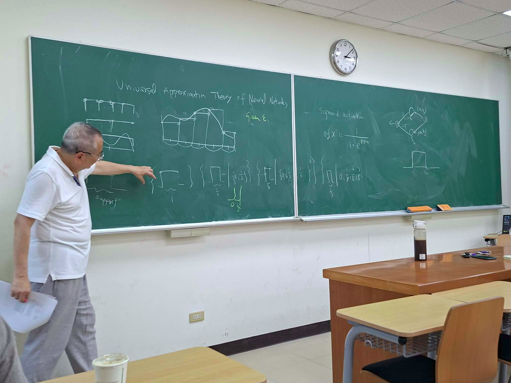
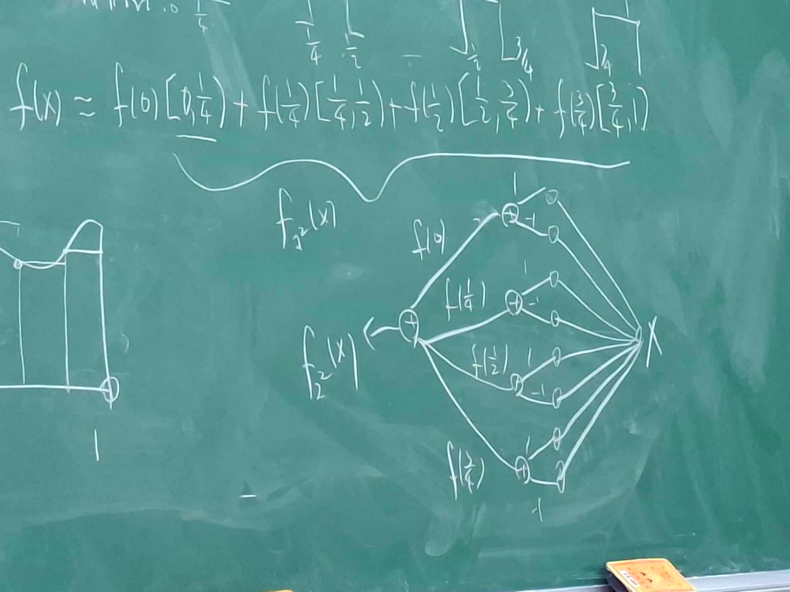

## Universal Approximation theorem of Neural Networks
concept almost all functions can be represented by NNs: 
$\{M:\ a\ shallow\ neural\ networks\}$ $\equiv$ $L^p(\mathbb R^n)$

(the expression part or capacity)

for any function $f\in L^p(R^n)$,
$\exists$ a neural network $M_f$ s.t. $\|M_f - f\| \le \epsilon$ for any $\epsilon>0$

###### remark
- the theorem does not provide algorithm to find $M_f$, which is the domain of PAC-analysis
(given $\epsilon,\delta$, find $M_f$ such that $\mathbb P(\|f-M_f\|<\epsilon) \ge 1-\delta$)
- the activation is support to by sigmoid $\theta_w(z) = \frac{1}{1+e^{-wz}}$
(when $w>0$, $\theta(-\infty)\to0, $$\theta(0)=\frac 12$, $\theta(\infty)\to 1$, the width and direction is adjusted by $w$)
- structure of NN:
$[{\rm affine\ mapping}]\to [{\rm sigmoid\ activation}]\to [{\rm affine\ mapping}]$
#### schedule
1. prove $R\to R$
2. prove $R^m \to R$
3. prove $R^m\to R^n$

$K\subseteq \mathbb R\to \mathbb R$: $K$ is a compact set.

#### proof of $\mathbb R\to\mathbb R$

first, we prove the following claim:
$\forall$ continuous functions $f$ on compact set which is dense in $L^p(R)$

objective: use Hard bases to approximate the function

sigmoid function can approximate the hard basis:

##### example
suppose we use only $4$ points to approximate $f$,
$f(x) \simeq f(0)[0,\frac 14) + f(\frac 14)[\frac 14, \frac 21) + f(\frac 12)[\frac 12, \frac 34) + f(\frac 34)[\frac 34,1)$
to ahieve this function, we need $8$ neuron:

with this step, we can approximate $f$ by approximate its hard basis by sigmoids.

such method can be generalized to $R^m\to R$, and therefore $R^n\to R^m$

## UAT for deep neural network
Arora et al.
1. continuous functions on compact support can be approximated by piecewise linear functions on the support

2. Any piecewise linear function can be approximated by ReLu network of finite width

